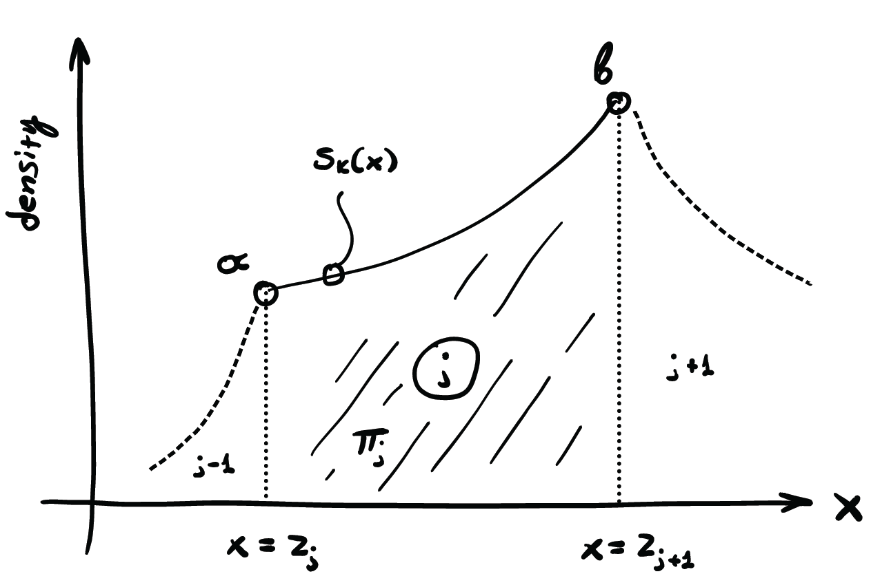
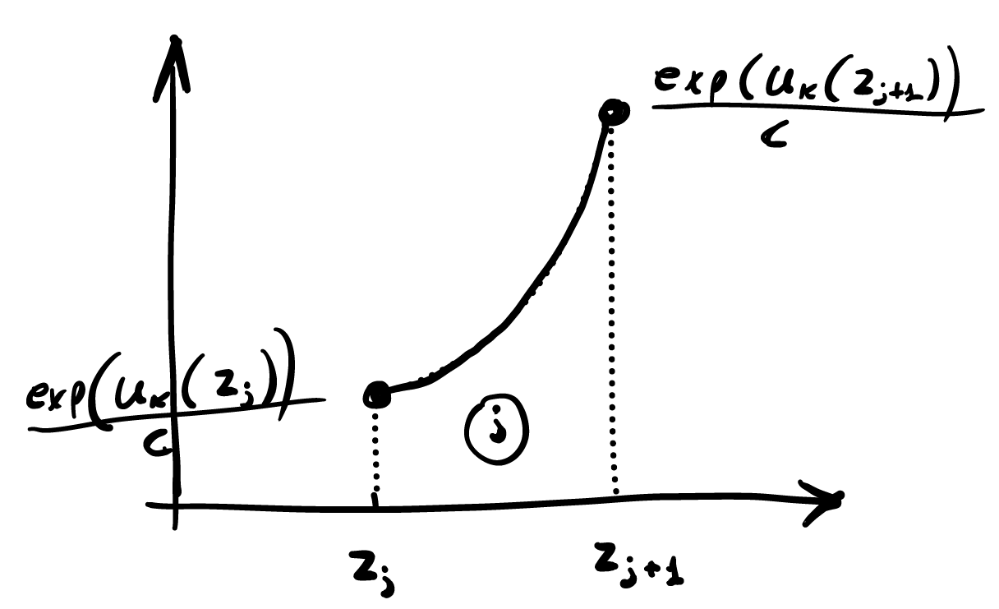

**Overall Approach**  
\
Our approach to create an adaptive rejection sampling package closely follows the details described in Section 2.2 of Gilks et al (1992). At a high level, our package ‘ars’ takes in an arbitrary log-concave input density, and outputs a random sample from the input density using standard principles of rejection sampling. To improve the performance of the sampling process, we implement methods inspired from Gilks et al (1992) to limit the amount of times the input density needs to be evaluated, in order to reduce costs attributed to the evaluation of a complex input density when taking a large sample.  
\
**Checks - Log Concavity, Bounds**  
\
A series of automated sanity checks are performed before the sampling algorithm is initiated. If the domain is not bounded, it is verified that the value of the density function at Inf evaluates to zero without overflowing. Then it is verified that the density function does evaluate to negative values. Finally, the derivative of the log of the function is being evaluated and it is verified that it is constantly decreasing, which signifies log-concavity. The derivative is obtained on 10,000 points that are centered around the approximate mean and have a dispersion defined by the approximate variance of the given density function.  

\
**Utility Functions**  
\
We have placed our utility functions in the utils.R file

Some of the utility functions we defined include:  
- uk(), which returns the upper enveloping function at a given point  
- lk(), which returns the lower enveloping function at a given point  
- init_abscissa(), which returns an set of abscissa, given an input density  
- exp_sampling(), which returns a sample of "x" values, sampling from a piece-wise exponential function of the upper hull of the input density 
\
**Data Structure and Updating**  
\
Next, the initialization_step function in the steps.R file creates the initial data structure for storing the abscissa in our current iteration, along with various other useful data points such as tangent points, slope, and vector length.  

Structure is in a list, with elements:  
- x, a vector of x values  
- hx, a vector containing evaluations of log density function at the given x values  
- dhx, a vector containing evaluations of derivative log density function at the given x values  
- z, a vector of the x values of the intersection points of the upper hull of the log density function  
- k, length of the x vector  
- a, lower bound of the domain  
- b, upper bound of the domain  

In the initialization step, we first call init_abscissa(), to create a initial values with 20 tangent points equally spaced along the domain.  

This data structure is updated with the update_step function, which takes in a list of the same structure, and then returns a sorted combination of the two lists.  

\
**Sampling**  
\
With our utility functions and data structure, we move onto the sampling steps of the adaptive rejection sampler. The first step of the adaptive rejection sampling process is to sample from a piecewise exponential density function, corresponding to the exponent of the upper hull function of the given log input density. To do so, we split the work into two steps.  

First, we choose which piece of the function to sample from. To do so, we sample from a multinomial, with a probability vector corresponding to the relative area of the upper hull between each intersection point. This will output a vector of indexes, that informs the sampler of which section of the piecewise exponential function to sample from.  
This process is performed with the exp_sampling() function. 

Next, given a vector of indexes, we transform a vector of uniform(0,1) samples to our corresponding input density, through Inverse Transform Sampling. 

Details described below  

## Sampling from a piecewise exponential density function

{width=50%}

$s(k)$ is a piecewise function, having parts $j \in \{1,2,...,K\}$ Sampling random variables from that function can be performed as follows.
Let $\pi_j$ denote the area underneath part $j$, having the domain $(z_j, z_{j+1})$. Drawing from a multinomial distribution, given the $\pi_j$ values, the problem can be broken into the $K$ individual parts.

{width=50%}

The problem has been reduced to sampling from a shifted exponential density. The domain of the PDF is $D = (z_j, z_{j+1})$.

Let $c = \int_D \exp(u_k(x))dx$

$$
s_k(x) = \frac{1}{c} \exp \left( \alpha x + \beta \right)
$$

where we have denoted

$$
\alpha = \frac{u_k(z_{j+1}) - u_k(z_j)}{z_{j+1}-z_j}
$$

$$
\beta = -\frac{u_k(z_{j+1}) - u_k(z_j)}{z_{j+1}-z_j} z_j + u_k(z_j)
$$

The CDF can be obtained by integration, as follows

$$
S_k(x) = \frac{1}{\pi_j} \int_{z_j}^x s_k(y) dy 
= \frac{e^\beta \left( e^{\alpha x} - e^{\alpha z_j} \right)}{\alpha c \pi_j}
$$
Where

$$
\pi_j = \frac{e^\beta \left( e^{\alpha z_{j+1}} - e^{\alpha z_j} \right)}{\alpha c}
$$

The inverse CDF can also be obtained analytically.

$$
p = S_k(x) = \frac{e^\beta \left( e^{\alpha x} - e^{\alpha z_j} \right)}{\alpha c \pi_j} =>
$$

$$
S_k^{-1}(p) = \frac{1}{\alpha} \log(e^{\alpha z_j} + \alpha c \pi_j e^{-\beta} p)
$$

Samples can be drawn from a random variable $p \sim U(0,1)$, and then the following transformation can be applied to have them follow the corresponding part $k$ of the piecewise exponential distribution, as follows:

$$
x = S_k^{-1}(p)
$$

Last, given our sampled values, we perform standard squeezing and rejection tests, using the lower and upper hulls functions of the log input density function. For all points evaluated in the rejection step, the evaluated points are added back into the list of points used to initialize the sampler. This process repeats until the required sample size is reached.  
\ 

**Contributions**  
\
For this project, we three worked together throughout much of the process. Most of the time was spent pair-programming, however we assigned each section for one of us to lead. In particular, Zhong was responsible for designing/updating the data structures, along with leading us on how to do documentation. John took the lead in the log-concavity/bounds tests, along with the theoretical calculations for the math. Victor was responsible for coding the sampling and rejection/squeezing steps, and took the lead on writing the write-up. 

